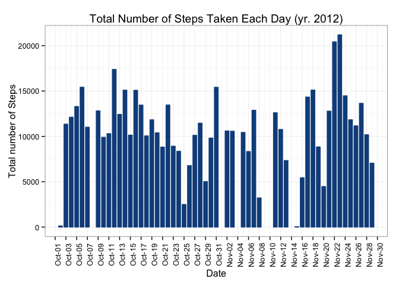
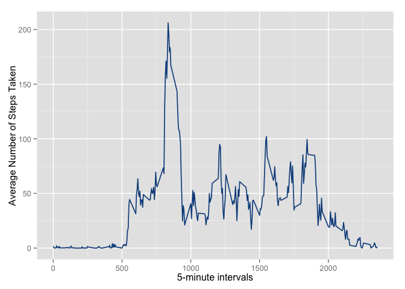
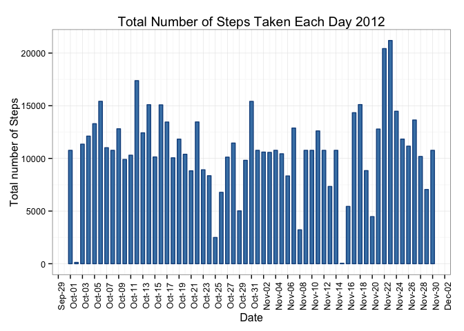
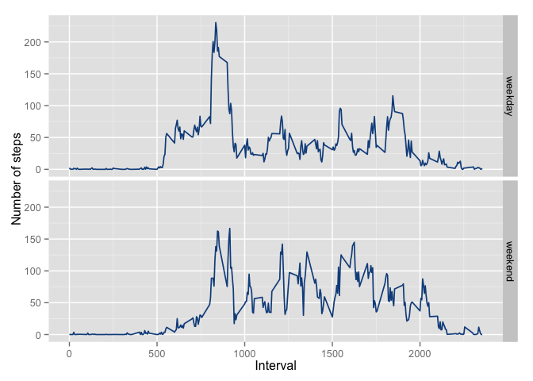

# Reproducible Research: Peer Assessment 1
## Setup environment

```r
options(scipen = 1, digits = 4)
Sys.setlocale("LC_TIME", "en_US")
setwd("~/Documents/Github/Reproducible Research/PeerAssessment1")
library(plyr)
library(ggplot2)
library(scales)
```
## Loading and preprocessing the data
1. Load the data (i.e. read.csv() ).

```r
dfActivity = read.csv("activity.csv", header=TRUE, sep=",")
```
2. Process/transform the data (if necessary) into a format suitable for your analysis.  
Variable dfActivityNoNA whithout NA's.

```r
dfActivity$date = as.Date(dfActivity$date)
dfActivityNoNA = na.omit(dfActivity)
```
## What is mean total number of steps taken per day?
1. Calculate the total number of steps taken per day.  

```r
dfDailyStats = ddply(dfActivityNoNA, 
               c("date"), 
               summarize, 
               sumSteps = sum(steps), 
               meanSteps = mean(steps)
               )
```
2. If you do not understand the difference between a histogram and a barplot, research the difference between them. Make a histogram of the total number of steps taken each day.  

```r
ggplot(dfDailyStats, aes(x=date, y=sumSteps)) + 
    geom_bar(stat="identity", colour = "dodgerblue4", fill = "dodgerblue4", width = 0.7) +
    labs(title = "Total Number of Steps Taken Each Day 2012") +
    ylab("Total number of Steps") + 
    xlab("Date") +
    theme_bw() + 
    theme(axis.text.x = element_text(angle=90)) + 
    scale_x_date(breaks="2 day", 
                 limits=c(min(dfDailyStats$date),max(dfDailyStats$date)),
                 labels = date_format("%b-%d")
                ) 
```

 
  
3. Calculate and report the mean and median of the total number of steps taken per day.

```r
meanSteps = mean(dfDailyStats$sumSteps)
medianSteps = round(median(dfDailyStats$sumSteps), 2)
```
The mean of total number of steps taken per day is: 10766.1887  
The median of total number of steps taken per day is: 10765  

## What is the average daily activity pattern?
* Make a time series plot (i.e. type = "l") of the 5-minute interval (x-axis) and the average number of steps taken, averaged across all days (y-axis).  

```r
dfIntervalStats = ddply(dfActivityNoNA, 
               c("interval"), 
               summarize, 
               meanSteps = mean(steps)
               )
ggplot(dfIntervalStats, aes(interval, meanSteps)) + 
    geom_line(color = "dodgerblue4", size = 0.6) + 
    labs("Time Series Plot of the 5-minute Interval") + 
    xlab("5-minute intervals") + 
    ylab("Average Number of Steps Taken")
```

 
  
* Which 5-minute interval, on average across all the days in the dataset, contains the maximum number of steps?

```r
dfIntervalStats[dfIntervalStats$meanSteps == max(dfIntervalStats$meanSteps), ]
```

```
##     interval meanSteps
## 104      835     206.2
```

## Imputing missing values
1. Calculate and report the total number of missing values in the dataset (i.e. the total number of rows with NA's).

```r
sum(is.na(dfActivity))
```

```
## [1] 2304
```
2. Devise a strategy for filling in all of the missing values in the dataset. The strategy does not need to be sophisticated. For example, you could use the mean/median for that day, or the mean for that 5- minute interval, etc.  
Due to I have calculated the mean by interval, I assume that missing value for an interval could be filled with the mean of the same interval.
3. Create a new dataset that is equal to the original dataset but with the missing data filled in.  

```r
dfNewActivity <- dfActivity 
for (i in 1:nrow(dfNewActivity)) {
    if (is.na(dfNewActivity$steps[i])) {
        dfNewActivity$steps[i] = dfIntervalStats[which(dfNewActivity$interval[i] == dfIntervalStats$interval), ]$meanSteps
    }
}
head(dfNewActivity)
```

```
##     steps       date interval
## 1 1.71698 2012-10-01        0
## 2 0.33962 2012-10-01        5
## 3 0.13208 2012-10-01       10
## 4 0.15094 2012-10-01       15
## 5 0.07547 2012-10-01       20
## 6 2.09434 2012-10-01       25
```
4. Make a histogram of the total number of steps taken each day and Calculate and report the mean and median total number of steps taken per day. Do these values differ from the estimates from the first part of the assignment? 

```r
dfDailyStats = ddply(dfNewActivity, 
               c("date"), 
               summarize, 
               sumSteps = sum(steps), 
               meanSteps = mean(steps)
               )
ggplot(dfDailyStats, aes(x=date, y=sumSteps)) + 
    geom_bar(stat="identity", colour = "dodgerblue4", fill = "steelblue", width = 0.6) +
    labs(title = "Total Number of Steps Taken Each Day 2012") +
    ylab("Total number of Steps") + 
    xlab("Date") +
    theme_bw() + 
    theme(axis.text.x = element_text(angle=90)) + 
    scale_x_date(breaks="2 day", 
                 limits=c(min(dfDailyStats$date),max(dfDailyStats$date)),
                 labels = date_format("%b-%d")
                ) 
```

 
  

```r
newMeanSteps = mean(dfDailyStats$sumSteps)
newMedianSteps = round(median(dfDailyStats$sumSteps), 2)
```
The mean of total number of steps taken per day is: 10766.1887  
The median of total number of steps taken per day is: 10766.19  

5. What is the impact of imputing missing data on the estimates of the total daily number of steps?  
Calculation differences of means and medians

```r
difMeanSteps = newMeanSteps - meanSteps
difMedianSteps = newMedianSteps - medianSteps
```
The difference of mean is: 0 (equals)  
The difference of median is: 1.19 (greather after fill the NA's obs.)  

## Are there differences in activity patterns between weekdays and weekends?
For this part the weekdays() function may be of some help here. Use the dataset with the filled-in missing values for this part.  
1. Create a new factor variable in the dataset with two levels – “weekday” and “weekend” indicating whether a given date is a weekday or weekend day.  

```r
dfNewActivity$daytype = factor(weekdays(dfNewActivity$date))
levels(dfNewActivity$daytype) <- list(weekday = c("Monday", "Tuesday", "Wednesday", "Thursday", "Friday"),
                                       weekend = c("Saturday", "Sunday"))
table(dfNewActivity$daytype)
```

```
## 
## weekday weekend 
##   12960    4608
```
2. Make a panel plot containing a time series plot (i.e. type = "l" ) of the 5-minute interval (x-axis) and the average number of steps taken, averaged across all weekday days or weekend days (y-axis). See the README file in the GitHub repository to see an example of what this plot should look like using simulated data.  

```r
dfIntervalStats = ddply(dfNewActivity, 
               c("interval", "daytype"), 
               summarize, 
               meanSteps = mean(steps)
               )
ggplot(dfIntervalStats, aes(interval, meanSteps)) + 
    geom_line(color = "dodgerblue4", size = 0.6) + 
    facet_grid( daytype ~ .) + 
    labs("Time Series Plot of the 5-minute Interval") + 
    xlab("Interval") + 
    ylab("Number of steps")
```

 
  
Conclusions:  
During the weekdays:  
    * The subject starts earlier their activity than on weekends.  
    * There is a peak that could be due to the subject goes walking to work.  
During the weekend:  
    * There are more activity during all the day.  

